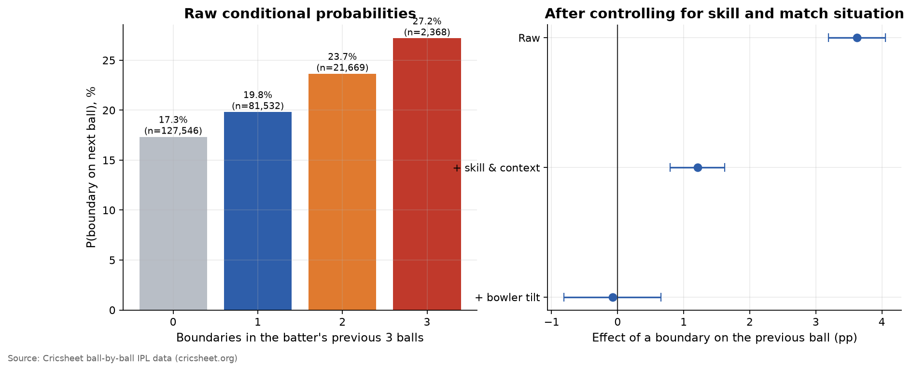
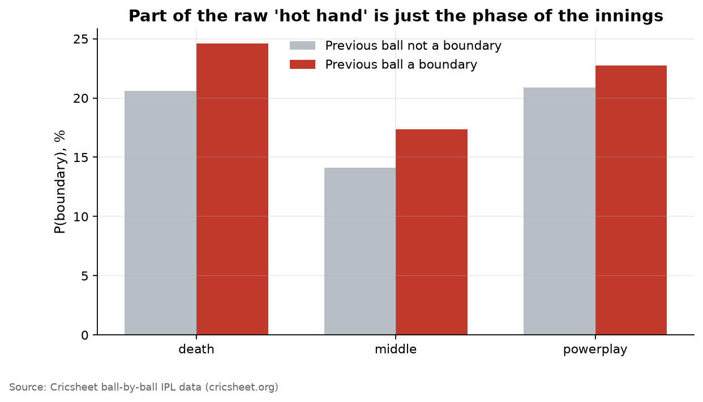
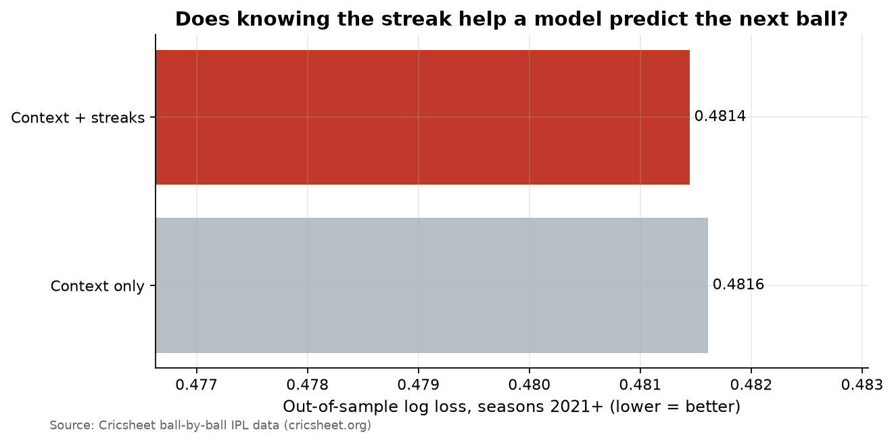

# Is There a Hot Hand in the IPL?

"He's seeing it like a football now." Commentators, captains and fans believe in momentum: once a batter hits a four, the next boundary is more likely. Behavioural economics has argued about the **hot hand** for 40 years. Gilovich, Vallone & Tversky (1985) called it a cognitive illusion in basketball. Miller & Sanjurjo (2018) showed the original test was biased and the hot hand may be real after all.

Cricket suits the question. Every ball is recorded, and the match situation (overs left, wickets in hand, who is bowling) can be controlled for precisely. This repo tests:
1. **Batter hot hand.** Does a boundary make the next ball more likely to go for four or six?
2. **Bowler tilt.** After being hit, does a bowler concede more?
3. **The ML test.** If streaks carry real information, a model that already knows the match context should predict the next ball *better* when it is also given the streak.

## Data
[Cricsheet](https://cricsheet.org) ball-by-ball JSON for **every IPL match since 2008**, downloaded on each run. Wides are dropped because the batter did not face them. Super overs are excluded.

## Method
**Controls that matter.** Raw streaks mislead because boundaries cluster for boring reasons: the powerplay and death overs, set batters, weak bowlers. Every model conditions on:
- **Batter skill and bowler skill.** Career boundary rates computed *leaving out the current match* (so a hot day doesn't inflate its own skill measure), shrunk towards the league mean.
- Phase of the innings, wickets fallen, balls faced (how "set" the batter is), innings, season.

**Estimators**
- Linear probability models with SEs clustered by match. Three streak measures: previous ball a boundary, boundaries in the last 3 balls, and the bowler hit on his previous ball.
- **Gradient boosting (histogram GBM)** trained on the first ~70% of seasons and tested on the rest. It is run twice, with context features only and with context plus streak features. If the hot hand is real and exploitable, out-of-sample log loss should fall.

## Results
<!-- RESULTS:START -->
_Auto-generated by `run.py` on 2026-09-25. Numbers refresh whenever the pipeline re-runs._

### Headline numbers

- 1,243 matches, 285,686 legal balls, seasons 2008–2026.
- Raw: P(boundary) after a boundary **21.2%** vs **17.5%** otherwise (a +3.7 pp 'hot hand').
- With batter/bowler skill, phase, wickets, balls faced, innings and season controls: **-0.08 pp** (95% CI -0.82 to +0.66).
- Bowler 'tilt': after the bowler was hit for a boundary on his previous ball, the next ball goes for a boundary **+1.54 pp** more often (raw gap +4.4 pp).
- ML test: adding streak features changes out-of-sample log loss by **+0.03%** (AUC 0.625 → 0.626).

### Regression estimates (linear probability, SEs clustered by match)

| Model | Term | Effect (pp) | 95% CI low | 95% CI high | p | N |
|---|---|---|---|---|---|---|
| Raw | prev_boundary | 3.621 | 3.189 | 4.054 | 0.000 | 255376 |
| + skill & context | prev_boundary | 1.208 | 0.795 | 1.622 | 0.000 | 255376 |
| + bowler tilt | prev_boundary | -0.079 | -0.815 | 0.658 | 0.834 | 255376 |
| + bowler tilt | bowler_hit_prev | 1.543 | 0.777 | 2.309 | 0.000 | 255376 |
| Streak of 3 | boundaries_last3 | 1.081 | 0.820 | 1.343 | 0.000 | 233115 |

### ML: train on early seasons, test on later ones

| Model | Test log loss | Test AUC | Improvement vs context (log loss, %) |
|---|---|---|---|
| Context only | 0.4816 | 0.6255 | 0.0000 |
| Context + streaks | 0.4814 | 0.6259 | 0.0343 |

### Figures

**Hot hand: raw vs controlled**



**By phase of innings**



**ML test**



<!-- RESULTS:END -->

## Reproduce
```bash
pip install -r requirements.txt
python run.py
```
The GitHub Action downloads the latest Cricsheet archive and re-runs on push and monthly, so each new IPL season is added automatically.

## Limitations
- Streaks are measured within a batter's innings. Miller & Sanjurjo's small-sample bias applies to within-sequence *averages*, not to the pooled regressions used here, but short innings still limit power for the 3-ball streak.
- Field placements change after a boundary. A captain who reacts to a streak can hide a real hot hand, which is a genuine identification problem.
- Skill is measured as career averages. Form over recent matches is a separate question from momentum within an innings.

## References
- Gilovich, T., Vallone, R. & Tversky, A. (1985). *The hot hand in basketball: on the misperception of random sequences.* Cognitive Psychology.
- Miller, J. & Sanjurjo, A. (2018). *Surprised by the hot hand fallacy? A truth in the law of small numbers.* Econometrica.
- Bocskocsky, A., Ezekowitz, J. & Stein, C. (2014). *The hot hand: a new approach to an old "fallacy".* MIT Sloan Sports Analytics Conference.
